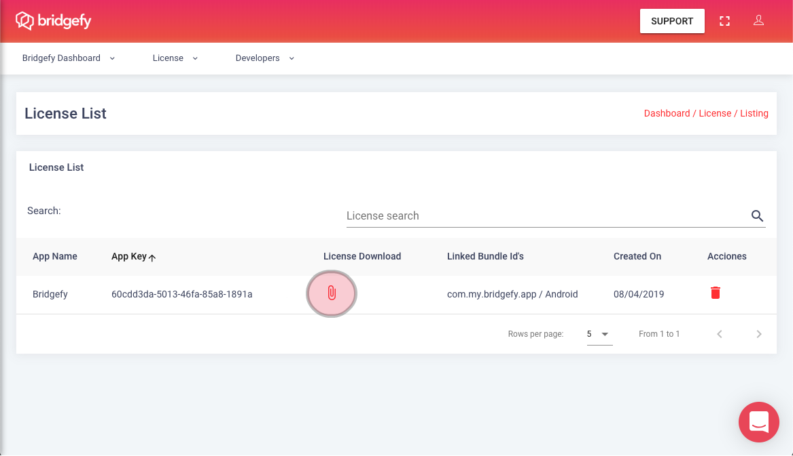
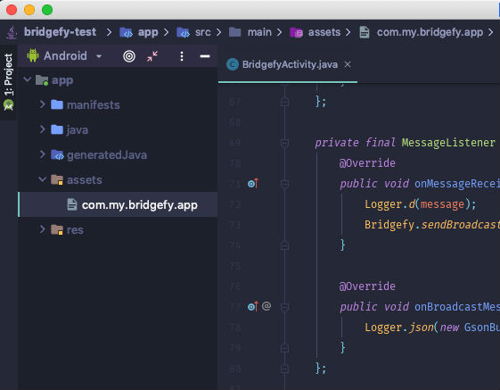

### Bridgefy 

<p align="center"><a href="https://bridgefy.me" target="_blank" rel="noopener noreferrer"></a></p>

  

### Overview

The Bridgefy Software Development Kit (SDK) is a state-of-the-art, plug-and-play package of awesomeness that will let people use your mobile app when they don’t have access to the Internet by using mesh networks.

Integrate the Bridgefy SDK into your [Android](https://github.com/bridgefy/bridgefy-android-samples) and [iOS](https://github.com/bridgefy/bridgefy-ios-developer) app to reach the 3.5 billion people that don’t always have access to an Internet connection, and watch engagement and revenue grow!

<p>Website. https://bridgefy.me/sdk/</p>
<p>Email. contact@bridgefy.me</p>
<p>Twitter. https://twitter.com/bridgefy</p>
<p>Facebook. https://www.facebook.com/bridgefy</p>

### Table of contents

1. [Quick Start Guide](#quick-start-guide)
	- [App Requirements](#app-requirements)
	- [Hardware Requirements](#hardware-requirements)
1. [Installation Instructions](#installation-instructions)
1. [Initialization](#initialization)
	* [Initialize Bridgefy](#initialize-bridgefy)
	* [Initialize Bridgefy Without Internet](#initialize-bridgefy-without-an-internet-connection)
1. [Starting Operations](#starting-operations)
	* [Automatic Operation](#automatic-operation)
	* [On Demand Operation](#on-demand-operation)
	    * [Connectivity](#connectivity)
	* [Configuration Options](#configuration-options)
	    * [Engine Profile](#engine-profile)
	    * [Energy Profile](#energy-profile)
1. [Sending Messages and Receiving Messages](#sending-messages-and-receiving-messages)
1. [Stopping Bridgefy](#stopping-bridgefy)
1. [Using ProGuard](#using-proguard)
1. [Full documentation](#full-documentation)
1. [Supported Devices](#supported-devices)
1. [Contact](#contact--support)

## Quick Start Guide

This guide will show you the necessary steps to start using the Bridgefy SDK on your app. 
The first step is to *generate an API KEY* after signing up for a developer account at http://bridgefy.me

### App Requirements
The Bridgefy SDK supports Android 5.0 (**API Level 21**) or higher and the following permissions are required:

```xml
    <uses-permission android:name="android.permission.INTERNET" />
    <uses-permission android:name="android.permission.BLUETOOTH" />
    <uses-permission android:name="android.permission.BLUETOOTH_ADMIN" />
```

If you're targeting devices with Android  6.0 (**API Level 23**) or higher, either one of the following permissions is also required:

```xml
    <uses-permission android:name="android.permission.ACCESS_FINE_LOCATION" />
    <uses-permission android:name="android.permission.ACCESS_COARSE_LOCATION" />
```

**Note.- Devices with Android 6.0 (API Level 23) or higher also need to have Location Services enabled.**


### Hardware requirements

This version is fine-tuned for Bluetooth Low-Energy (BLE) capable devices. While it is not required, it is preferable that the _BLE advertising mode_ is also supported. The Bridgefy SDK will let you know during initialization if your devices support _BLE advertising_ or not. At least one device should support advertising mode in order for connections to be allowed and, thus, messaging functionality to be successful.

## Installation Instructions

In order to include the Bridgefy SDK in your project, first add the Bridgefy maven repository in your app's gradle file. You also need to make sure that your module is compatible with Java 8 (https://developer.android.com/studio/write/java8-support.html):

```javascript

android {
    ...
    repositories {
         ...
         maven {
             url "http://maven.bridgefy.com/artifactory/libs-release-local"
             artifactUrls=["http://jcenter.bintray.com/"]
              }
        ...
        }
    ...
    compileOptions {
        targetCompatibility JavaVersion.VERSION_1_8
        sourceCompatibility JavaVersion.VERSION_1_8
    }
}
```


Then, add the dependency:

```javascript
implementation 'com.bridgefy:android-sdk:2.0.0'
```
## Initialization

### Initialize Bridgefy
The Bridgefy SDK needs only a call to the static `initialize()` method in order to create all required objects and to be ready to start operations.

The result of the initialization will be delivered asynchronously to the **RegistrationListener** object.

```java
// Always use the Application context to avoid leaks
Bridgefy.initialize(getApplicationContext(), YOUR_API_KEY, new RegistrationListener() {
    @Override
    public void onRegistrationSuccessful(BridgefyClient bridgefyClient) {
        // Bridgefy is ready to start
        Bridgefy.start(messageListener, stateListener);
    }
    
    @Override
    public void onRegistrationFailed(int errorCode, String message) {
        // Something went wrong: handle error code, maybe print the message
        ...    
});
```
Alternatively, you can remove the **API_KEY** parameter if you included one in your **AndroidManifest.xml** file.

```xml
<meta-data
        android:name="com.bridgefy.sdk.API_KEY"
        android:value="..." />
```


This call requires an active Internet connection on the device in order to check the status of your Bridgefy license. As long as your license is valid, an Internet connection won't be needed again until the time comes to renew or update it.

The following error codes may be returned if something went wrong:

```php
-66    registration failed (check specific reason in message)
-1     registration failed due to a communications error (e.g. no Internet available)
-2     registration failed due to a misconfiguration issue
-3     registration failed due to an expired or unauthorized license
```


A unique **userId** string is also generated locally for your convenience, in order to identify the local device.
This value is returned in the callback when the SDK is successfully initialized.

### Initialize Bridgefy without an Internet connection

Add the certificate file that was generated along with your API Key in the  `assets` folder of your app. The file name must match the applicationId specified in your app's gradle file.
If there is no Internet connection available, the SDK will use this certificate to validate your licence.



**This certificate has a deadline of 4 weeks after you create an API Key from the Bridgefy Dashboard. Once the certificate expires, the Bridgefy SDK will require Internet connectivity on behalf of the device running the SDK to validate the subscription and continue using the Bridgefy software. This model will be valid for all developers that download the Bridgefy SDK during April 2020. Terms and conditions, as well as the above mentioned rule, may change.**




Once the Bridgefy SDK has been correctly registered, the **onRegistrationSuccessful** method is called and you're now ready to start the Bridgefy SDK.
Use the following method to begin the process of nearby device discovery as well as to advertise presence to other devices.

```java
Bridgefy.start(messageListener, stateListener);
```

If Bridgefy starts correctly, the **onStarted()** method of the **StateListener** will be called. If something goes wrong, one of the following error codes may be returned in the **onStartError** callback:

```php
-10    Bluetooth Low Energy not supported
-20    Insufficient permissions
-30    Location Services disabled
-40    Initialization error
```

#
## Starting Operations
Bridgefy can now work in two modes of operation: automatic and on-demand connectivity.

### Automatic Operation 

**Automatic operation:** In previous versions of the SDK, it automatically connects when it discovers nearby devices, creating a mesh network. The size of this network depends on the number of devices connected to each other, with the environment as a variable factor, allowing you to join networks and connect to nodes in different networks and, possibly, nodes in other networks.

The maximum number of connections depends on the software and hardware requirements of the Android device, with ~5 connections usually supported


### On-Demand Operation

**On-Demand:** This mode of operation notifies the discovery of nearby devices. Unlike the automatic mode of operation, the developer can choose which device to make a connection with and the device will be notified as being connected to the listener.


It is important to consider that in On-Demand mode for this version, **only direct messages are supported**. Mesh and broadcast messages are not supported for this version.

**StateListener for on-demand operation mode**

````java
    @Override
    public void onDeviceDetected(Device device) {
                
    }
    
    @Override
    public void onDeviceUnavailable(Device device) {
                
    }
````
`onDeviceDetected`: is called when a device with the same on-demand configuration profile is detected

`onDeviceUnavailable`: is called when a device detected is not available

#### Connectivity
Connects on-demand, by detecting a device with the same operating mode, Bridgefy exposes the method of connection with another device.

````java
    Bridgefy.getInstance().getBridgefyCore().connectDevice(Device deviceDetected);
````

**StateListener** will be listening for connection and disconnection events with a certain device.

To disconnect a particular device, call the following method:

````java
    Bridgefy.getInstance().getBridgefyCore().disconnectDevice(Device deviceConnected); // Bridgefy class
    // or
    session.disconnect(); // Session active for device
````

The **StateListener** callback will also let you know every time a successful connection has been established with a nearby Bridgefy device. It will also notify you when a device has moved out of range or has disconnected for another reason.

```java
@Override
public void onDeviceConnected(Device device, Session session) {
    // Do something with the found device
    device.sendMessage(...);
}
 
@Override
public void onDeviceLost(Device device) {
    // Let your implementation know that a device is no longer available
    ...
}
```

### Configuration Options
You can also provide a custom **Config** object to set additional options

```java
    Config.Builder builder = new Config.Builder();

    builder.setAutoConnect(false)                                       // Determinate on-demand / auto connect
    builder.setEngineProfile(BFEngineProfile.BFConfigProfileLongReach)  // Engine Profile
    builder.setEnergyProfile(BFEnergyProfile.HIGH_PERFORMANCE)          // Energy Profile 
    builder.setEncryption(false);                                       // Encryption
    
    Bridgefy.start(messageListener, stateListener, builder.build());

```

#### Engine Profile
The desired profile to determine the framework behavior or the specific treatment for an individual message.

**Profile**                             |  **Description**
:-------------                      | -------------
BFConfigProfileDefault              | The standard profile to use in most general-network conditions.
BFConfigProfileHighDensityNetwork   | This profile is fine-tuned for massive congregations with a high amount of activated devices expected, such as concerts or demonstrations.
BFConfigProfileSparseNetwork        | This profile is perfect for places with a rather low density of activated devices such as remote communities or campgrounds.
BFConfigProfileLongReach            | This profile ensures that the biggest effort to deliver your message is made. This profile should be reserved for emergency situations and be used sparingly. In general it's not a good idea to use this method to initialize the SDK as a whole, but rather to use it only to send specific messages.
BFConfigProfileShortReach           | This profile is meant to be used for sending information that might be replaced frequently as it's duration is short-lived
BFConfigProfileNoFowarding          | This profile is only meant to be used if you don't want your messages to be stored or forwarded. This means that a message will be delivered once and then discarded. It will not be forwarded via mesh.

#### Energy Profile
The profile to run the Bridgefy framework with. Connection reliability is a priority across all profiles, but they differ in terms of how often messages will be relayed and how quickly new devices will be discovered, among other internal tweaks to preserve device battery life.

**Profile**               |  **Description**
:-------------            | -------------
ENERGY_SAVER              | The most power-efficient profile. Device discovery and self-advertising will be brought down to a minimum, but incoming connections will be accepted without any delay.
BALANCED                  | The most balanced profile. A fine-tuned balanced profile with quick device discovery and a consistent self-advertising frequency.
HIGH_PERFORMANCE          | The highest performance profile but also the most power-consuming. Typically it will discover nearby devices almost instantly and perform the most connection retries after interruptions, among other tweaks.


## Sending Messages and receiving Messages

In order to send Messages you will need to build a **Message** object which is basically a **HashMap** tied to a **UUID** represented as a string; this way, Bridgefy will know where to send it.

```java
    // Build a HashMap object
    HashMap<String, Object> data = new HashMap<>();
    data.put("foo","Hello world");
     
    // Create a message with the HashMap and the recipient's id
    Message message =new Message.Builder().setContent(data).setReceiverId(device.getUserId()).build();
     
    // Send the message to the specified recipient
    Bridgefy.sendMessage(message);
```

You can send messages to other devices even if they haven't been reported as connected or in-range. The Bridgefy SDK will do its best effort to deliver the message to its recipient through intermediate devices. Message content is secured through a 256-bit encryption which is managed seamlessly for you, so you don't have to worry about other users tapping into your private messages.

You can also send public messages, which will be distributed to all nearby devices. Those are even easier to send:

```java
    // Send a Broadcast Message with just the HashMap as a parameter
    Bridgefy.sendBroadcastMessage(data);
```

**Note: Broadcast messages for automatic-operation mode only**

The MessageListener callback will inform you of new messages that you have received. Check the Javadoc documentation for the full list of method callbacks.

  
```java
@Override
    public void onMessageReceived(Message message) {
    // Do something with the received message
    ...
}

@Override
    public void onBroadcastMessageReceived(Message message) {
    // Public message sent to all nearby devices
    ...
}
```

**Note.- Occasionally, the Bridgefy SDK may produce a duplicated call on these methods some time after the message was first received. Depending on your implementation, you might want to prepare for these scenarios.**

## Stopping Bridgefy
Always make sure to stop the Bridgefy instance in order to free up device resources, once they're no longer needed. This depends on your real-world use case, and your own preferences.


```java
Bridgefy.stop();
```


## Using ProGuard

If you are using Proguard in your project, include the following lines to your configuration file:

```java
-keep class com.bridgefy.sdk.** { *; }
-dontwarn com.bridgefy.sdk.**
-dontwarn org.w3c.dom.bootstrap.DOMImplementationRegistry
-keepattributes *Annotation*,EnclosingMethod,Signature
-keepnames class com.fasterxml.jackson.** { *; }
 -dontwarn com.fasterxml.jackson.databind.**
 -keep class org.codehaus.** { *; }
 -keepclassmembers public final enum org.codehaus.jackson.annotate.JsonAutoDetect$Visibility {
 public static final org.codehaus.jackson.annotate.JsonAutoDetect$Visibility *; }
-keep class org.msgpack.core.**{ *; }
-dontwarn org.msgpack.core.**
```

## Full documentation

The full javadoc can be consulted [here](https://www.bridgefy.me/docs/javadoc/).

## Supported Devices

As of April 2020, the following devices have been tested with Bridgefy and offer the best performance:

* Google Pixel 2
* Google Pixel
* Nexus 6P
* Nexus 5X
* Nexus 6
* Samsung Galaxy S8
* Samsung Galaxy S7
* Samsung Galaxy S6
* Moto Z
* Moto Z Play
* Moto G4
* Moto G4 Plus
* Moto E 2nd gen
* OnePlus One
* OnePlus 3T
* OnePlus 5
* Sony Xperia Z5
* Sony Xperia Z5 Compact
* Raspbery Pi 3 (Android Things)

Performance may depend on the Android version installed on the device. Custom roms are not officially supported. Other devices not listed here should still work with Bridgefy but no assessment has been made regarding their performance. This list will continue to grow as we test new devices.

## Contact & Support

* contact@bridgefy.me

**© 2020 Bridgefy Inc. All rights reserved**
